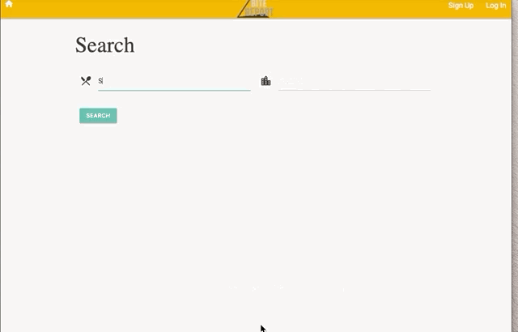
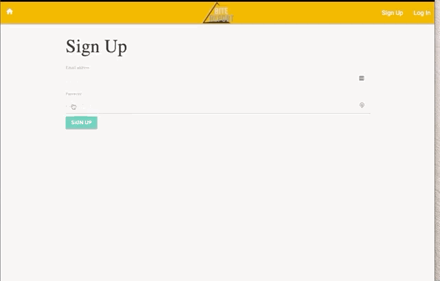
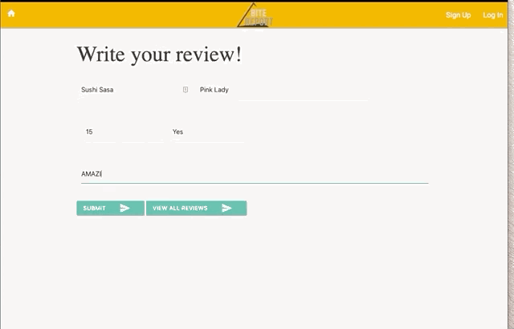

  

  # BiteReport

  ## Table of Contents
  * [Description](#Description)
  * [Motivation for Development](#Motivation)
  * [Deployed Website](#Deployed)
  * [User Story](#User)
  * [Installation](#Installation)
  * [Usage](#Usage)
  * [Contributing](#Contributing)
  * [Tests](#Tests)
  * [Questions](#Questions)
  * [Author](#Author)
  * [License](#License)
  
  
  
  
  
  
  
  

  ## Description
 A restaurant app that enables a user to save personal reviews about restaurant menu items and whether you enjoyed them or not.

     
          

     
     

  ## Motivation for Development
 Recalling details about previous meals or drinks you’ve had at a specific eatery can sometimes be difficult to recall especially if it's been a long time since your last visit.

     
          

     
     

  ## User Story
 As a restaurant goer, I want an application where I can enter my personal reviews of dishes or drinks that I enjoyed so that I can easily recall them next time I visit.

 
    
    
    
    
    

*Search for a Restaurant*      
   
---

 
  
 
 
   
  
  
  
  

     
     
     
     

*Sign Up*     
   
---

     
     
     
     
    
  
  

      
      
      

*Write a Review*      
  
---

       
  
  
  

       

## Deployed Website: 
https://bitereport.herokuapp.com/ 

  ## Installation
  This application is installed via node.js, Sequelize, Handlebars,  with npm dependency.

  ## Usage
  A restaurant app that enables a user to save information about restaurant menu items. You can save information about a dish or drink you tried, and the ingredients used.

  ## Contributing
  If you'd like to expand upon this application, please fork the repository and code away. You may also reach out to the developers directly if you wish to collaborate.

  ## Tests
  To test the code, you can run via VScode or any other coding platform. Open a browser and connect to your local host and database.

  ## Questions
  Please send any questions or comments to the author listed below.

  ## Authors:
  Claudio Gallo, Jake Haberle, Metasabeya Ketsela, Keldan Cundy, Gabrielle Maxey

   Email: [Gabrielle Maxey](gmaxey@gmail.com)     

   Github:      
  [Gabrielle Maxey](https:/github.com/GabrielleM45),     
  [Claudio Gallo](https://github.com/mrclaudiogallo),    
  [Jake Haberle](https://github.com/jhaberle),     
  [Metasabeya Ketsela](https://github.com/metasabeya),    
  [Keldan Cundy](https://github.com/keldykins)      

  ## License
  *This application is Licensed under the following:*\
  **[mit](https://choosealicense.com/licenses/mit/)**

